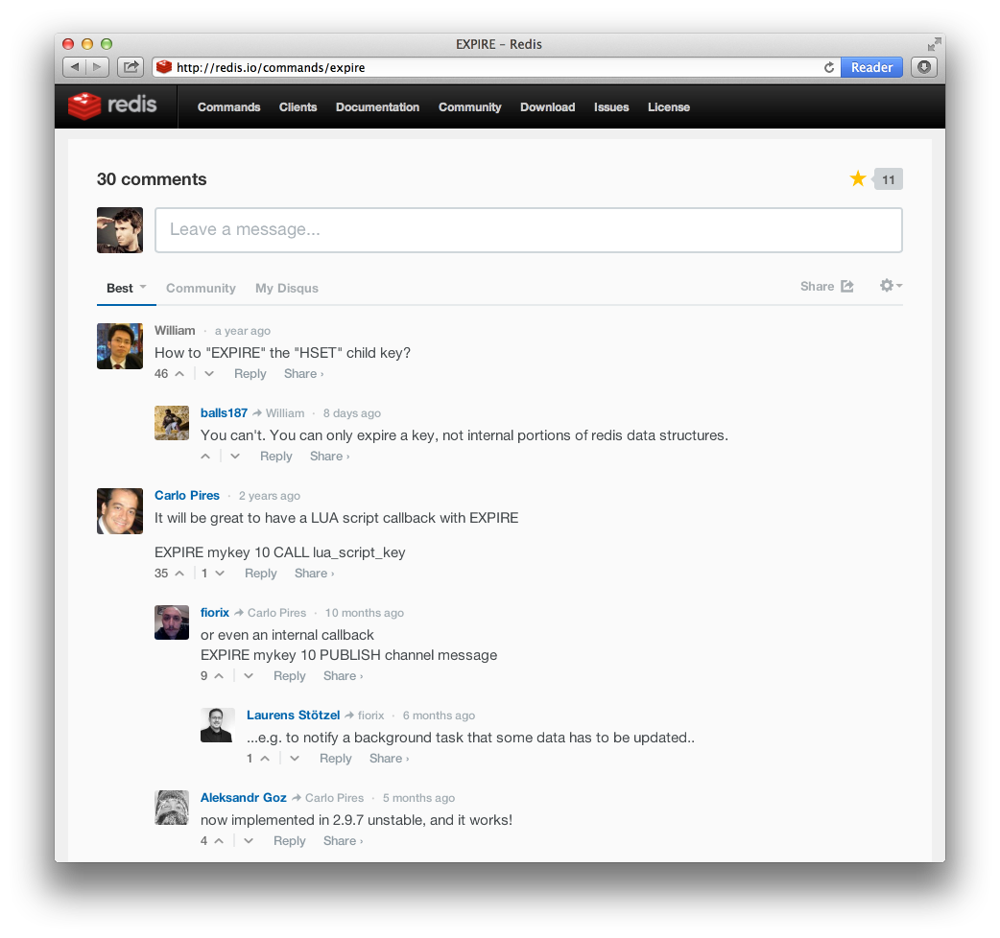
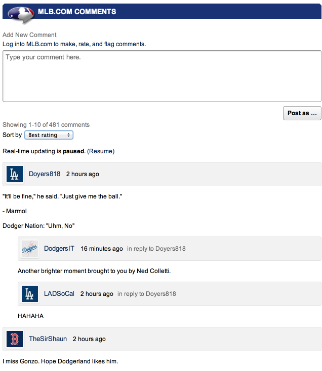
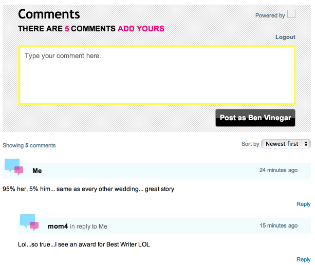
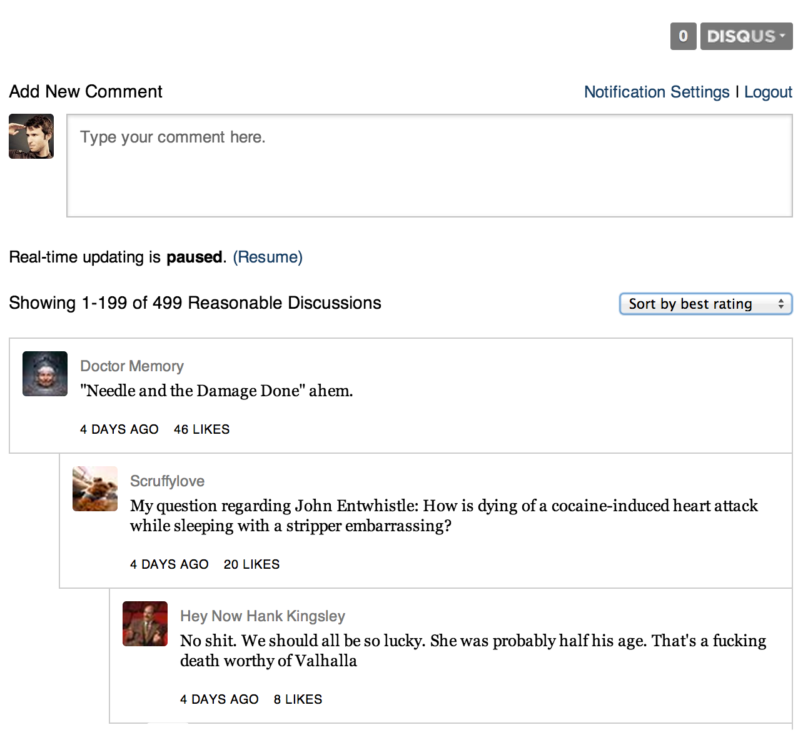
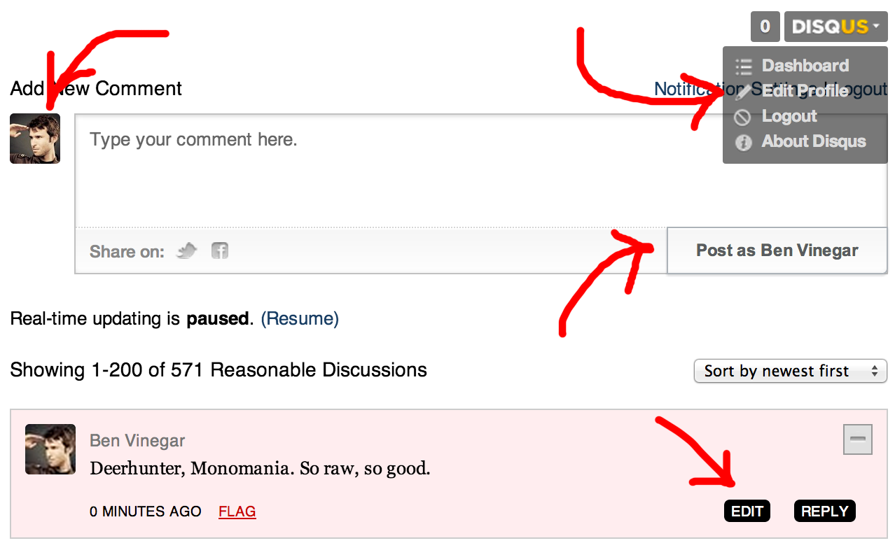
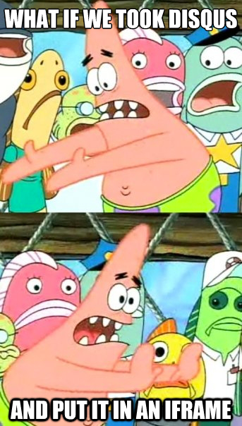
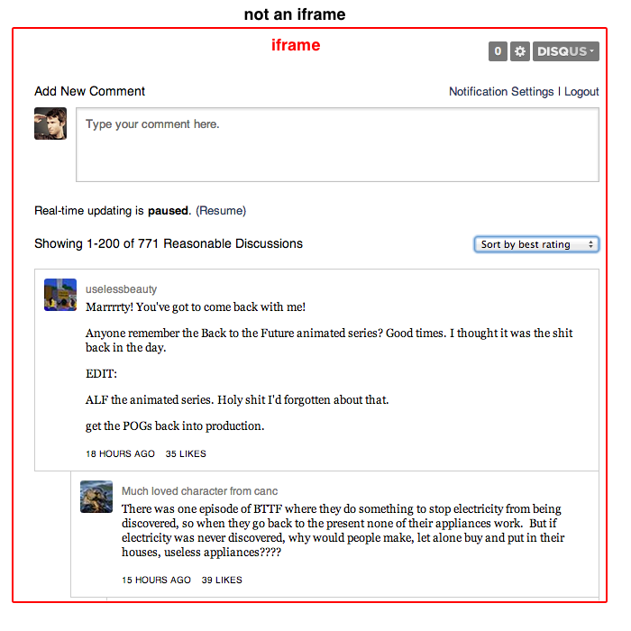
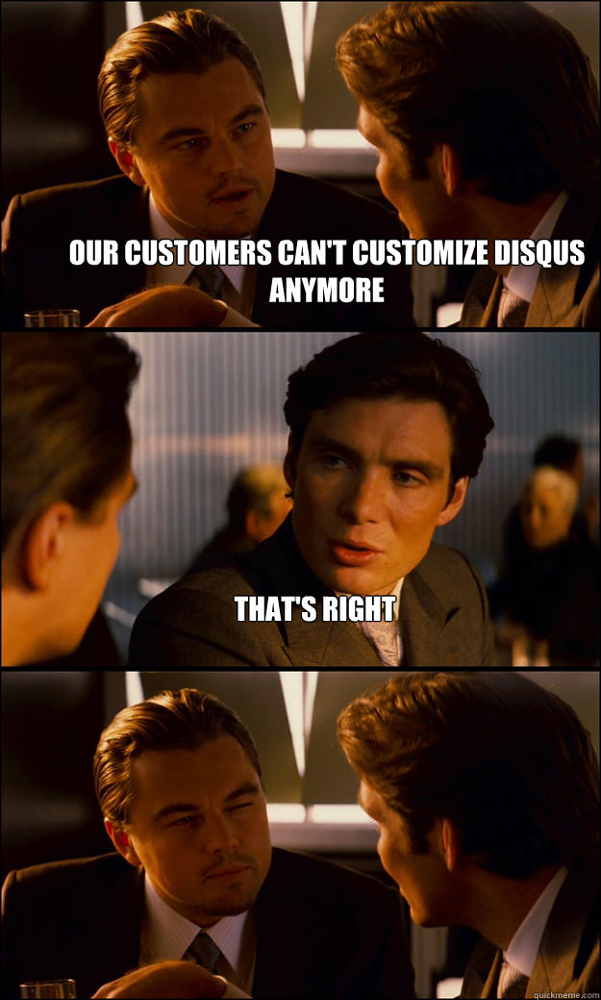
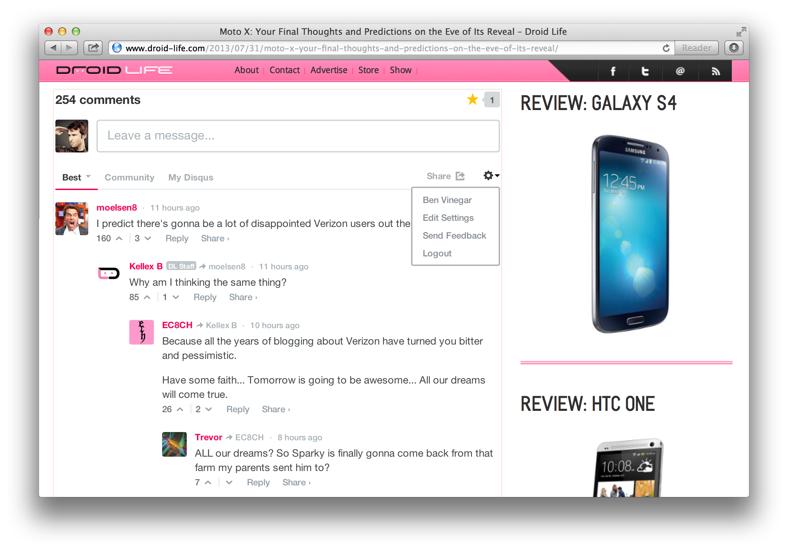
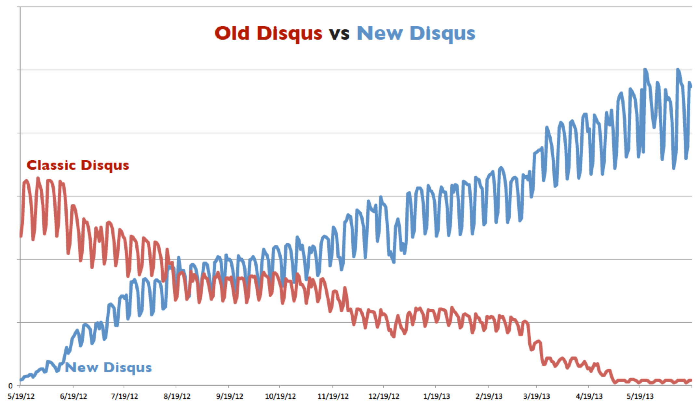

# Backbone at Disqus
## A postmortem

Ben Vinegar / [@bentlegen](http://twitter.com/bentlegen)


<em>post&bullet;mor&bullet;tem</em> – an analysis or discussion of an<br/> event after it is over


<blockquote style="box-shadow:none">These guys are pretty good at the JavaScripts, and you should definitely buy their book. 
	<br>– Amazon review</blockquote>


<blockquote class="no-shadow" class="twitter-tweet"><p>45 pages in and I’m pretty sure Third Party JavaScript should be required reading for all client-side js devs.</p>&mdash; Rebecca Murphey (@rmurphey) <a href="https://twitter.com/rmurphey/statuses/328142255149944833">April 27, 2013</a></blockquote>





```javascript
(function() {
	var dsq = document.createElement('script');
	dsq.type = 'text/javascript';
	dsq.async = true;
	dsq.src = 'http://disqus.disqus.com/embed.js';
	(document.getElementsByTagName('head')[0] || 
	 	document.getElementsByTagName('body')[0]
	).appendChild(dsq);
})();
```


## About Disqus

* Web's largest networked commenting platform
* Big sites: CNN, Wired, IGN, Rolling Stone, NPR ...
* Dev sites: Ruby on Rails, Redis, ruby-doc.org ...


## Obligatory stats

* 1 billion uniques/month
* nearly 1 million comments/day
* Realtime: 3 million concurrent connections daily
<li class="fragment">16 engineers</li>


## YC '07 (Cambridge, MA)


## Flashback


## Disqus in 2011

* SAAS commenting platform ($)
* Tiers: Plus, Pro, VIP
* Very customizable
* Template editor, CSS targetable


## Architecture + product woes

* Inconsistent product experience
* Difficult to introduce new features
* Brittle, buggy
* Security and privacy issues


<section>
	<h2>Many faces</h2>
</section>
<section>
	
</section>
<section>
	
</section>
<section>
	
</section>


## Hard to introduce new stuff

* Elements rendered directly on publisher DOM
* They can use CSS to hide elements they don't like
<li class="fragment"> ... or just remove them with JavaScript</li>


## CSS arms race

```html
<div class="disqus-collapse">
	<button>Collapse post<button>
</div>
```

```css
/* Us */
#disqus-container .disqus-collapse {
	/* ... */
}

/* Them */
#our-container #disqus-container .disqus-collapse {
	display: none !important;
}
```


## Brittle

* Most of Disqus's old code ran on the host page
* Web publishers have messy JS envs
* We spent a lot of time debugging extraneous stuff


## People actually do this

```javascript
// Them
Array.prototype.push = function (val) {
	this[this.length] = val;
}

// Us
var someArray = [];
someArray.push(2, 3);
console.log(someArray);
// => [2]
```


## Privacy issues

* Disqus – use one identity on multiple communities
* User identity rendered on DOM
* Publisher can extract visitor information











## Why iframes

* Same-Origin Policy prevents access from parent document
* Can't be modified, inspected
* No more code conflicts
* XSS vulnerabilities scoped to our document


## The grand rewrite 

* Re-write our entire client-side codebase
* Re-architect to use iframes
* IE8 and up only (postMessage)





## Not just a refactor

* Many features going away (e.g. customizations)
* New version must be compelling
* New: overhauled UI
* New: realtime comments


## Choosing a framework


## Not your typical SPA

* No address bar / permalinks
* Loaded repeatedly
* Maybe even multiple times per page
* Short lived


## Backbone.js

* Light ... "doesn't do too much"
* Extensible
* Filesize


## Ender.js (!Ember)

* JavaScript microlibrary framework
* jQuery-like API ($)
* Small footprint

```javascript
Backbone.$ = root.jQuery || root.Zepto || root.ender || root.$;
```


## Less &amp; Bootstrap


## The result

* Project start December 2011
* Open beta on May 3rd, 2012
* Official release June 15th, 2012


<iframe src="http://player.vimeo.com/video/43917945?title=0&amp;byline=0&amp;portrait=0" width="500" height="281" frameborder="0" webkitAllowFullScreen mozallowfullscreen allowFullScreen></iframe>


## Hurdles / solutions


## Iframes

* Solved our major technical problems
<li class="fragment"> ... but we added some new ones</li>
<li class="fragment"> ... but we also got some bonus good stuff</li>


## Iframe pain points

* Can't listen to events on parent document
* Doesn't automatically resize to fit content
* Doesn't know viewport location
* Doesn't know URL or document fragment





## Parent document

```javascript
document.addEventListener('click', function () {
	var msg = {
		event: 'window.clicked'
	};

	iframe.contentWindow.postMessage(
		JSON.stringify(msg),
		'//disqus.com' // Target origin
	)	
}, false);
```


## Iframed document
```javascript
window.onmessage = function (evt) {
	var msg = JSON.parse(evt.data);

	switch (msg.name) {
		case 'window.clicked':    /* ... */ break;
		case 'window.scroll':     /* ... */ break;
		case 'window.hashchange': /* ... */ break;
	}
}
```


## Throw some  on it


## Backbone + postMessage

```javascript
var Bus = Backbone.extend({}, Backbone.Events);
	
window.onmessage = function (evt) {
	var msg = JSON.parse(evt.data);

	Bus.trigger(msg.name, msg.data);
}

```


## Listening to events

```javascript
var UserMenu = Backbone.View.extend({
	initialize: function () {
		this.listenTo(Bus, 'window.click', this.closeMenu);
	},

	closeMenu: function () { ... },

	// ... rest of view definition
});

```


## Bonus: Content-Security Policy

http://benvinegar.github.io/csp-talk-2013/


## Instance wrangling


## Uniqueness problem

* Many different collections
* Some models appear multiple times
* Some models are "fresher" than others
* Changes to one model should update all instances


```javascript
var posts = new PostCollection([
	{ 
		'id': '1375382',
		'message': 'What a great article, Ben!'
		'author': {
			'username': 'benvinegar',
			'displayName': 'Ben Vinegar'
		}
	},
	{
		'id': '1375387',
		'message': 'Great show old boy.'
		'author': {
			'username': 'benvinegar',
			'displayName': 'Ben Vinegar'
		}
	},
]);
```


## New vs old data

```javascript
session.login(); // => 'benvinegar'

session.get('displayName'); // => 'Ben "Salt N" Vinegar'

posts
	.get('1375382')
	.get('author')
	.get('displayName'); // => 'Ben Vinegar' :(
```


## How does this happen?

* 90% of traffic to Disqus is "anonymous"
* Commenting data is heavily cached (CDN)
* Augment with fresh session-based data


## Backbone.UniqueModel
```javascript
var UniqueUser = Backbone.UniqueModel(User);

var first  = new UniqueUser({ 
	username: 'benvinegar',
	name: 'Ben Vinegar'
});

var second = new UniqueUser({
	username: 'benvinegar', 
	name: 'Ben "Salt N" Vinegar'
});

first === second; // => true
first.get('name') === 'Ben "Salt N" Vinegar';
```


## Multiple frames / windows


<iframe width="420" height="315" src="//www.youtube.com/embed/DAGOvXq-b48" frameborder="0" allowfullscreen></iframe>


## Event proxies


## Multiple user models

```javascript
// Logged out (anonymous)
this.session = new AnonUser();

// Logged in
this.session = new User();

// Single sign-on
this.session = new SingleSignOnUser();
```


## Instance replacement

```javascript
var UserMenu = Backbone.View.extend({
	initialize: function (options) {
		this.session = options.session;

		this.listenTo(Bus, 'window.click', this.closeMenu);
		this.listenTo(session, 'change', this.render);
	},

	closeMenu: function () { ... },

	// ... rest of view definition
});

// Elsewhere
this.session = new User();
```


```javascript
var Session = Backbone.Model.extend({
	initialize: function () {
		this.set(new AnonUser())
	},

	set: function (user) {
		this.clear();

		this.user = user;
		this.user.on('all', this.proxy, this);
	},

	clear: function () {
		this.user.off('all', this.proxy, this);
		this.user = null;
	},

	proxy: function (/* event args */) {
		this.trigger.apply(this, arguments);
	}
}
```


## Today

* 99% of network uses new version
* We've grown 50% in the last year	





## Still evolving the stack

* Unit tests in mocha/sinon
* Handlebars templates
* Grunt build process
<li class="fragment">Converted to jQuery</li>


## Parting thoughts


## Peace out, thanks

* @bentlegen
* disqus.com/jobs
